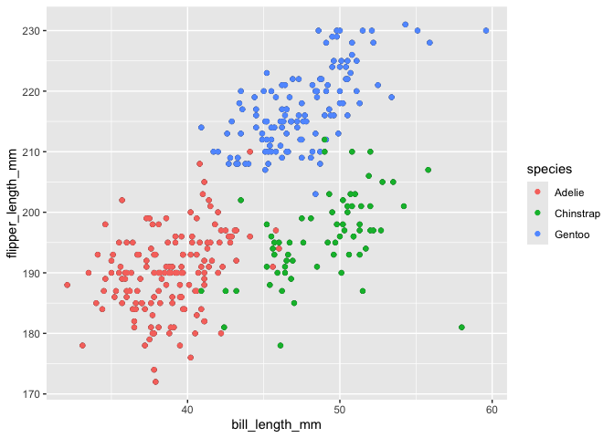

p8105_hw1_ryd2106
================
Risa Dickerman
2026-09-25

# Problem 1

``` r
#Load in data frame
data("penguins", package = "palmerpenguins")
```

The penguins dataset from the palmerpenguins package described the
morphological features of 344 different birds. There were 8 different
variables observed. These variables included the bird’s bill_length_mm,
bill_depth_mm, flipper_length_mm, body_mass_g, sex in addition to the
penguin’s species, the island they lived on, and the year the samples
were collected. The species, island, and sex variables were all factor
(category) values denoted by fct. The bill_length_mm and bill_depth_mm
variables were numeric (dbl) while the year, flipper_length_mm, and
body_mass_g were all integers (int).

This study found several interesting statistics of the penguins on the
following islands: Torgersen, Biscoe, Dream. For example, it was found
that the mean flipper length of all these birds lie at 201mm.

Visualizations of certain features are presented below:

A scatter plot of the flipper length vs the bill length of these
penguins is shown below:

``` r
#Create the scatterplot and save
ggplot(data = penguins, mapping = aes(x = bill_length_mm, y = flipper_length_mm)) + geom_point() + geom_point(aes(color=species))
```

<!-- -->

``` r
ggsave("hw_scatterplot.pdf")
```

\#Problem 2

``` r
#Setting the seed
set.seed(21061)

#Producing a data frame
prob2_df = tibble(
  vec_random = rnorm(10, mean = 0, sd= 1 ),
  vec_logical = (vec_random > 0),
  vec_character = c("It", "was", "the", "best", "of", "times,", "it", "was", "the", "worst.."),
  vec_factor = factor(c("mild", "medium", "medium", "hot", "mild", "hot", "medium", "hot", "medium", "mild"))
)

#Take the mean of the variables
  #Mean of the random vector
mean_random = mean(
  pull(prob2_df,1))
  #Mean of the logical vector
mean_logical = mean(
  pull(prob2_df,2))
  #Mean of the character vector
mean_character = mean(
  pull(prob2_df,3))
  #Mean of the factor vector
mean_factor =mean(
  pull(prob2_df,4))
prob2_df
```

    ## # A tibble: 10 × 4
    ##    vec_random vec_logical vec_character vec_factor
    ##         <dbl> <lgl>       <chr>         <fct>     
    ##  1    -1.63   FALSE       It            mild      
    ##  2    -1.60   FALSE       was           medium    
    ##  3    -0.682  FALSE       the           medium    
    ##  4     0.0979 TRUE        best          hot       
    ##  5    -0.530  FALSE       of            mild      
    ##  6    -0.702  FALSE       times,        hot       
    ##  7    -0.737  FALSE       it            medium    
    ##  8    -0.324  FALSE       was           hot       
    ##  9    -1.17   FALSE       the           medium    
    ## 10     0.214  TRUE        worst..       mild

When taking the mean of each variable in the prob2_df, some make sense
while others do not. The most logical result is the random vector’s
(vec_randomn) mean of -0.706972. The mean of the logical vector
(vec_logical), however, returns the numerical value 0.2 even though it
is taken from the logical values TRUE and FALSE. Finally, taking the
mean of both the character (vec_character) and factor (vec_factor)
vectors return a NA value.

One can attempt to get these non-numeric values to become integers
through the as.numeric function but the results are mixed.

``` r
#Convert the logical vector to a numerical answer
as.numeric(
  pull(prob2_df,2))
#Convert the character vector to a numerical answer
as.numeric(
  pull(prob2_df,3))
#Convert the factor vector to a numerical answer
as.numeric(
  pull(prob2_df,4))
```

The logical values, for example, revert to 1’s and 0’s. This is because
logical statements are Boolean data types. Within this Boolean frame
TRUE equals 1, while FALSE equals 0. Therefore, it makes since that the
mean of these values would produce a numeric answer. When the as.numeric
function is applied to the character vector, a vector of NA values are
returned. This makes sense because in R there are no inlaid assignment
of numbers to character values. It is therefore impossible to retrieve a
logical answer when applying functions that treat the vector as
numerical values. The factor vector returns a set of 1’s, 2’s, and 3’s.
These values signify a ordinal vector was created where each label
(e.g., mild) were assigned a number (e.g., 3) corresponding to the
degree of intensity. The data type is not a numeric value but when the
as.numeric function is applied these values revert to the number value.
When the mean is taken of this resulting numeric vector you can obtain a
logical mean of 2.
